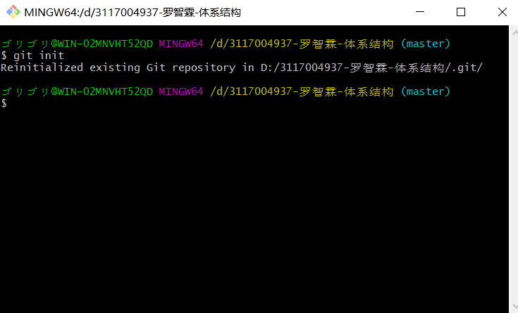
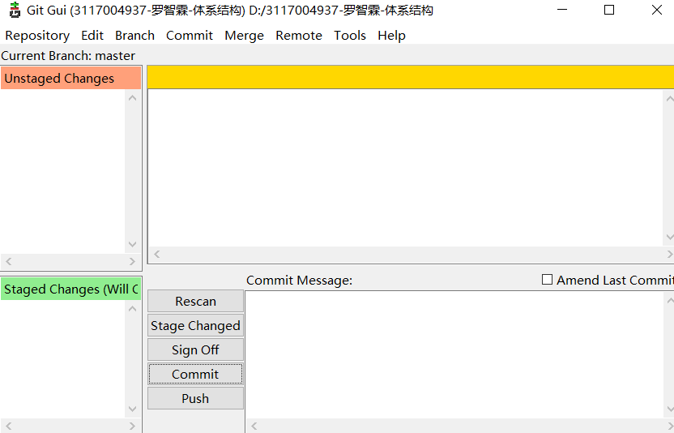
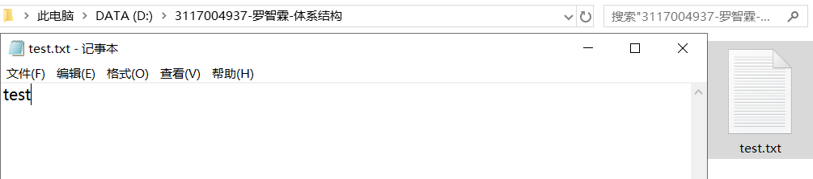
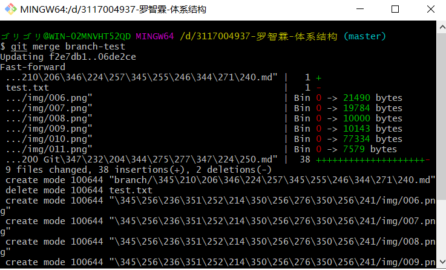

实验一 Git的使用 

# 实验目的

了解Git如何使用，包括 Git 软件的安装和简单使用，比如 增加文件，提交，创建分支，增加远程，下拉、上推，合并等内容。 

# 实验平台

win10 64位 

# 实验前准备

Git安装包：Git-2.26.0-64-bit.exe 

# 实验内容

## 使用准备

在D盘建立文件夹“3117004937-罗智霖-体系结构”：

   

初始化一个空的git本地仓库
&ensp;&ensp;&ensp;&ensp;git bash here刚建的文件夹：

 

输入git init完成初始化：

 

git gui here该文件夹进入gui界面：

 

## 增加文件与提交

“3117004937-罗智霖-体系结构”文件夹下新建test记事本，任意输入内容：

 

gui页面下刷新，输入提交备注，commit提交：

 

 

repository查看历史提交内容：

 

## 创建分支

“3117004937-罗智霖-体系结构”文件夹下新建branch文件，branch文件下新建分支学习md文件：

 

历史中的“文件提交”，右键create new branch：

 

git gui界面，branch，checkout跳至分支，查看历史，已出现分支：

 

## 合并分支

git bash here“3117004937-罗智霖-体系结构”文件夹，输入git merge branch-test将master分支合并到branch-test分支：

 

 

##上推与下拉

# 实验总结

 
