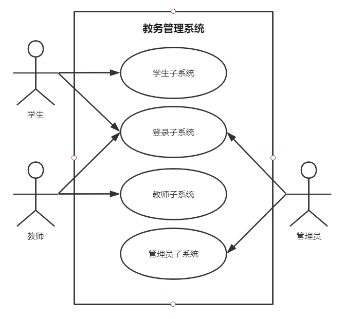
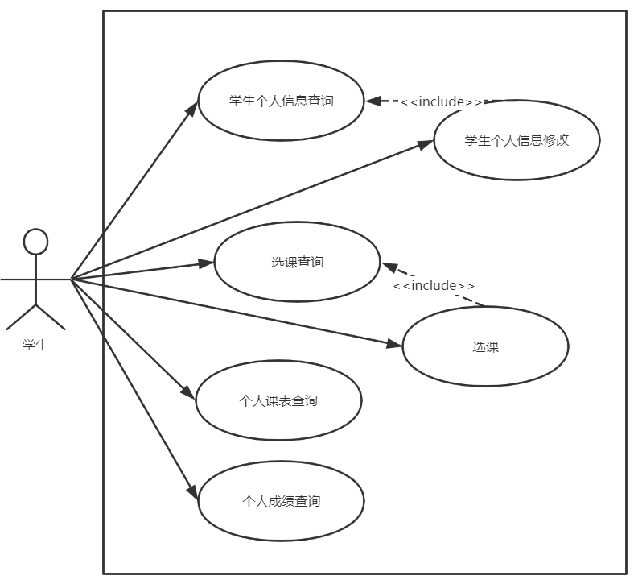
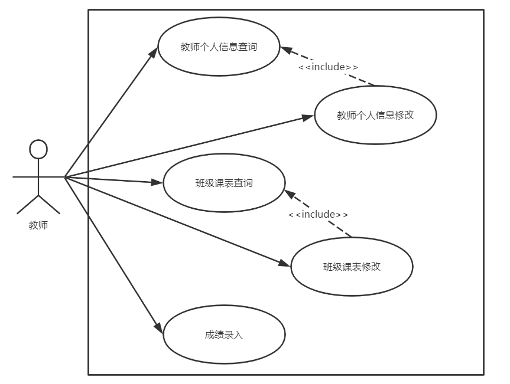
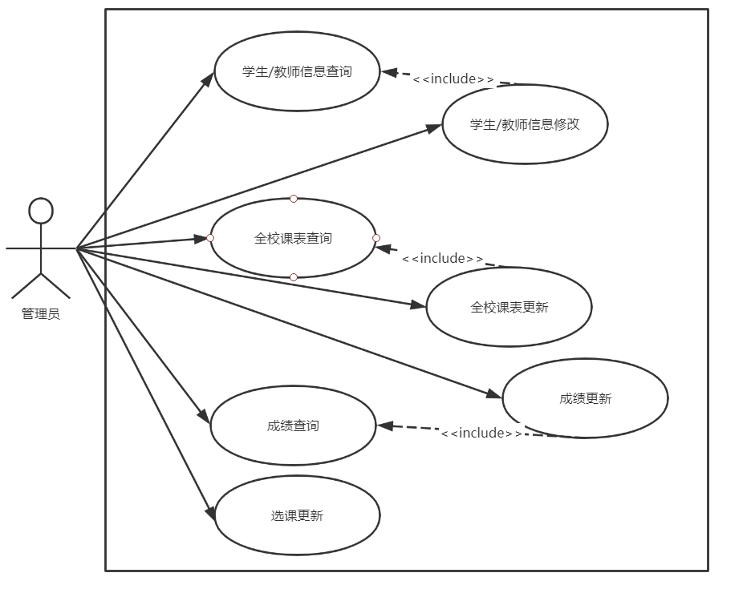

# 绪论

## 题目背景及意义
近年来随着教育普及，各高校逐年扩大招生规模，使得在校学生人数增加突飞猛进，办学规模逐步增大，专业设置日趋多样化，这使得高校教务管理的工作量大幅度增加。并且，随着教育改革的深化，教学管理模式也在发生变化，如学分制的逐步实行、学生可以自主选课等。这就对原有的教学管理模式提出了更高的要求。另一方面，随着计算机网络技术的发展，日渐趋于无纸化办公。在这样的形势下，开发一个高效的教务管理系统实为大势所趋。

## 关键技术简介
###程序设计语言
该教务管理系统的实现采用基于面向对象的Java语言。
###开发环境
eclipse自带的tomcat服务，搭建的JSP开发环境。 数据库：SQL Server 2017

# 需求分析
## 角色定义

### 学生
  该角色主要参与了教务系统的登录；个人信息查询和修改；课表查询；选课查询；成绩查询等功能。
### 教师
  该角色主要参与了教务系统的登录；个人信息查询和修改；课表查询并修改；成绩录入等功能。
### 管理员
  该角色主要参与了教务系统的登录；学生信息查询和管理；教师信息查询和管理；课表管理；选课管理；成绩管理等功能。

## 系统主用例图
  教务管理系统主要分为4个部分：登录子系统、学生子系统、教师子系统和管理子系统。登录子系统主要为学生、教师和管理员提供登录教务系统功能；学生子系统是学生通过登录后进行的功能；教师子系统是教师通过登录后进行的功能；管理员系统是管理员登录后对整个教务管理系统的数据进行管理。
&ensp;&ensp;&ensp;&ensp;系统主用例图：
  

   

<table><tr><td> 用例编号</td><td> 01
</td></tr><tr><td>用例名</td><td> 登录
</td></tr><tr><td> 用例描述</td><td> 登录教务系统
</td></tr><tr><td> 参与者</td><td> 用户（学生、教师、管理员）
</td></tr><tr><td> 前置条件</td><td> 系统的登录页面正常运行
</td></tr><tr><td> 后置条件</td><td> 成功登录教务系统
</td></tr><tr><td> 主事件流</td><td><ol><li>用户进入系统的登录页面；
<li>用户输入ID和密码进行登录；
<li>系统对用户提交的ID和密码进行有效性检查；
<li>检查通过，跳转到教务页面。
</ol></td></tr><tr><td>备选事件流</td><td><ul><li>3a. 用户输入的ID为空或不存在
	1. 系统提示ID不能为空或ID不存在
	2. 用户离开或重新输入登录信息
<li>3b. 用户输入的密码为空或错误
	1. 系统提示请输入正确密码
	2. 用户离开或重新输入密码
</ul></td></tr></table>

## 功能需求分析
###  学生功能
  学生通过输入学号和密码登录学生子系统后可操作学生的功能。学生功能包括个人信息查询和修改；课表查询；选课查询；成绩查询等。
&ensp;&ensp;&ensp;&ensp;学生在学生子系统中的用例图：
  

   

#### 学生个人信息查询
<table><tr><td> 用例编号</td><td> 02
</td></tr><tr><td>用例名</td><td> 学生个人信息查询
</td></tr><tr><td> 用例描述</td><td> 学生登录教务系统，查询个人信息
</td></tr><tr><td> 参与者</td><td> 学生
</td></tr><tr><td> 前置条件</td><td> 学生成功登录系统
</td></tr><tr><td> 后置条件</td><td> 显示学生个人信息
</td></tr><tr><td> 主事件流</td><td><ol><li>学生选择“个人信息查看”；
<li>后台查询学生个人信息；
<li>显示学生个人信息。
</ol></td></tr><tr><td>备选事件流</td><td><ul><li>无
</ul></td></tr></table>

#### 学生个人信息修改
<table><tr><td> 用例编号</td><td> 03
</td></tr><tr><td>用例名</td><td> 学生个人信息修改
</td></tr><tr><td> 用例描述</td><td> 学生登录教务系统，修改个人信息
</td></tr><tr><td> 参与者</td><td> 学生
</td></tr><tr><td> 前置条件</td><td> 学生进入个人信息界面
</td></tr><tr><td> 后置条件</td><td> 显示新的学生个人信息
</td></tr><tr><td> 主事件流</td><td><ol><li>学生选择“个人信息修改”；
<li>跳转至学生个人信息修改页面；
<li>输入新的学生信息；
<li>更新学生个人信息；
<li>返回学生个人信息页面。
</ol></td></tr><tr><td>备选事件流</td><td><ul><li>无
</ul></td></tr></table>

#### 选课查询
<table><tr><td> 用例编号</td><td> 04
</td></tr><tr><td>用例名</td><td> 选课查询
</td></tr><tr><td> 用例描述</td><td> 学生登入教务系统，查询选课
</td></tr><tr><td> 参与者</td><td> 学生
</td></tr><tr><td> 前置条件</td><td> 学生成功登入教务系统
</td></tr><tr><td> 后置条件</td><td> 显示个人选课信息
</td></tr><tr><td> 主事件流</td><td><ol><li>学生选择“选课查询”；
<li>系统跳转返回学生“个人选课信息”。
</ol></td></tr><tr><td>备选事件流</td><td><ul><li>无
</ul></td></tr></table>

#### 选课
<table><tr><td> 用例编号</td><td> 05
</td></tr><tr><td>用例名</td><td> 选课
</td></tr><tr><td> 用例描述</td><td> 学生登入教务系统，进行选课
</td></tr><tr><td> 参与者</td><td> 学生
</td></tr><tr><td> 前置条件</td><td> 学生成功登入教务系统
</td></tr><tr><td> 后置条件</td><td> 返回选课信息
</td></tr><tr><td> 主事件流</td><td><ol><li>学生选择“选课”；
<li>系统跳转“选课信息”页面，包括课程名、可选人数、已选人数等；
<li>学生进行“选课”；
<li>系统更新并返回选课信息。
</ol></td></tr><tr><td>备选事件流</td><td><ul><li>无
</ul></td></tr></table>

#### 个人课表查询
<table><tr><td> 用例编号</td><td> 06
</td></tr><tr><td>用例名</td><td> 个人课表查询
</td></tr><tr><td> 用例描述</td><td> 学生登入教务系统，查询个人课表
</td></tr><tr><td> 参与者</td><td> 学生
</td></tr><tr><td> 前置条件</td><td> 学生成功登入教务系统
</td></tr><tr><td> 后置条件</td><td> 显示个人课表信息
</td></tr><tr><td> 主事件流</td><td><ol><li>学生选择“个人课表查询”；
<li>系统跳转返回学生“个人课表信息”。
</ol></td></tr><tr><td>备选事件流</td><td><ul><li>无
</ul></td></tr></table>

#### 个人成绩查询
<table><tr><td> 用例编号</td><td> 07
</td></tr><tr><td>用例名</td><td> 个人成绩查询
</td></tr><tr><td> 用例描述</td><td> 学生登入教务系统，查询个人成绩
</td></tr><tr><td> 参与者</td><td> 学生
</td></tr><tr><td> 前置条件</td><td> 学生成功登入教务系统
</td></tr><tr><td> 后置条件</td><td> 显示个人成绩
</td></tr><tr><td> 主事件流</td><td><ol><li>学生选择“个人成绩查询”；
<li>系统跳转返回学生“个人成绩信息”。
</ol></td></tr><tr><td>备选事件流</td><td><ul><li>无
</ul></td></tr></table>

### 教师功能
  教师通过输入工号和密码登录教师子系统后可操作教师的功能。教师功能包括个人信息查询和修改；课表查询并修改；成绩录入等。
&ensp;&ensp;&ensp;&ensp;教师在教师子系统中的用例图：
  

   

#### 教师个人信息查询
<table><tr><td> 用例编号</td><td> 08
</td></tr><tr><td>用例名</td><td> 教师个人信息查询
</td></tr><tr><td> 用例描述</td><td> 教师登录教务系统，查询个人信息
</td></tr><tr><td> 参与者</td><td> 教师
</td></tr><tr><td> 前置条件</td><td> 教师成功登录系统
</td></tr><tr><td> 后置条件</td><td> 显示教师个人信息
</td></tr><tr><td> 主事件流</td><td><ol><li>教师选择“个人信息查看”；
<li>后台查询教师个人信息；
<li>显示教师个人信息。
</ol></td></tr><tr><td>备选事件流</td><td><ul><li>无
</ul></td></tr></table>

#### 教师个人信息修改
<table><tr><td> 用例编号</td><td> 09
</td></tr><tr><td>用例名</td><td> 教师个人信息修改
</td></tr><tr><td> 用例描述</td><td> 教师登录教务系统，修改个人信息
</td></tr><tr><td> 参与者</td><td> 教师
</td></tr><tr><td> 前置条件</td><td> 教师进入个人信息界面
</td></tr><tr><td> 后置条件</td><td> 显示新的教师个人信息
</td></tr><tr><td> 主事件流</td><td><ol><li>教师选择“个人信息修改”；
<li>跳转至教师个人信息修改页面；
<li>输入新的教师信息；
<li>更新教师个人信息；
<li>返回教师个人信息页面。
</ol></td></tr><tr><td>备选事件流</td><td><ul><li>无
</ul></td></tr></table>

#### 班级课表查询
<table><tr><td> 用例编号</td><td> 10
</td></tr><tr><td>用例名</td><td> 班级课表查询
</td></tr><tr><td> 用例描述</td><td> 教师登入教务系统，查询班级课表
</td></tr><tr><td> 参与者</td><td> 教师
</td></tr><tr><td> 前置条件</td><td> 教师成功登入教务系统
</td></tr><tr><td> 后置条件</td><td> 显示班级课表信息
</td></tr><tr><td> 主事件流</td><td><ol><li>教师选择“班级课表查询”；
<li>系统跳转返回“班级课表”。
</ol></td></tr><tr><td>备选事件流</td><td><ul><li>无
</ul></td></tr></table>

#### 班级课表修改
<table><tr><td> 用例编号</td><td> 11
</td></tr><tr><td>用例名</td><td> 班级课表修改
</td></tr><tr><td> 用例描述</td><td> 教师登入教务系统，修改班级课表
</td></tr><tr><td> 参与者</td><td> 教师
</td></tr><tr><td> 前置条件</td><td> 教师进入班级课表信息页面
</td></tr><tr><td> 后置条件</td><td> 更新班级课表信息
</td></tr><tr><td> 主事件流</td><td><ol><li>教师选择“班级课表修改”；
<li>系统跳转至班级课表修改页面；
<li>输入新的班级课表信息；
<li>更新班级课表；
<li>系统跳转返回新的“班级课表”。
</ol></td></tr><tr><td>备选事件流</td><td><ul><li>无
</ul></td></tr></table>

#### 成绩录入
<table><tr><td> 用例编号</td><td> 12
</td></tr><tr><td>用例名</td><td> 成绩录入
</td></tr><tr><td> 用例描述</td><td> 教师登入教务系统，录入成绩
</td></tr><tr><td> 参与者</td><td> 教师
</td></tr><tr><td> 前置条件</td><td> 教师成功登入教务系统
</td></tr><tr><td> 后置条件</td><td> 更新学生成绩
</td></tr><tr><td> 主事件流</td><td><ol><li>教师选择“成绩录入”；
<li>系统跳转至该教师的“学生成绩”页面；
<li>筛选排序，根据学号、姓名、科目等录入成绩；
<li>更新学生成绩信息；
<li>系统跳转返回“学生成绩”页面。
</ol></td></tr><tr><td>备选事件流</td><td><ul><li>无
</ul></td></tr></table>

### 管理员功能
  管理员通过输入工号和密码登录后台子系统后可操作管理员的功能。管理员功能包括学生信息查询和管理；教师信息查询和管理；课表管理；选课管理；成绩管理等。
&ensp;&ensp;&ensp;&ensp;管理员在管理员子系统中的用例图：
  

   

#### 学生/教师信息查询
<table><tr><td> 用例编号</td><td> 13
</td></tr><tr><td>用例名</td><td> 学生/教师信息查询
</td></tr><tr><td> 用例描述</td><td> 以管理员身份登入教务系统，查询学生/教师信息
</td></tr><tr><td> 参与者</td><td> 管理员
</td></tr><tr><td> 前置条件</td><td> 管理员身份登入系统
</td></tr><tr><td> 后置条件</td><td> 显示学生/教师信息
</td></tr><tr><td> 主事件流</td><td><ol><li>管理员选择“信息查看”；
<li>后台查询学生/教师信息；
<li>显示学生/教师信息。
</ol></td></tr><tr><td>备选事件流</td><td><ul><li>无
</ul></td></tr></table>

#### 学生/教师信息修改
<table><tr><td> 用例编号</td><td> 14
</td></tr><tr><td>用例名</td><td> 学生/教师信息修改
</td></tr><tr><td> 用例描述</td><td> 管理员登入教务系统，修改学生/教师信息
</td></tr><tr><td> 参与者</td><td> 管理员
</td></tr><tr><td> 前置条件</td><td> 管理员进入学生/教师信息页面
</td></tr><tr><td> 后置条件</td><td> 显示新的学生/教师信息
</td></tr><tr><td> 主事件流</td><td><ol><li>管理员选择“信息修改”；
<li>跳转至学生/教师信息修改页面；
<li>输入新的学生/教师信息；
<li>更新学生/教师信息；
<li>返回学生/教师信息页面。
</ol></td></tr><tr><td>备选事件流</td><td><ul><li>无
</ul></td></tr></table>

#### 全校课表查询
<table><tr><td> 用例编号</td><td> 15
</td></tr><tr><td>用例名</td><td> 全校课表查询
</td></tr><tr><td> 用例描述</td><td> 管理员登入教务系统，查询全校课表
</td></tr><tr><td> 参与者</td><td> 管理员
</td></tr><tr><td> 前置条件</td><td> 管理员成功登入教务系统
</td></tr><tr><td> 后置条件</td><td> 显示全校课表信息
</td></tr><tr><td> 主事件流</td><td><ol><li>管理员选择“全校课表查询”；
<li>系统跳转返回“全校课表”。
</ol></td></tr><tr><td>备选事件流</td><td><ul><li>无
</ul></td></tr></table>

#### 全校课表更新
<table><tr><td> 用例编号</td><td> 16
</td></tr><tr><td>用例名</td><td> 全校课表更新
</td></tr><tr><td> 用例描述</td><td> 管理员登入教务系统，更新全校课表
</td></tr><tr><td> 参与者</td><td> 管理员
</td></tr><tr><td> 前置条件</td><td> 管理员进入全校课表页面
</td></tr><tr><td> 后置条件</td><td> 更新全校课表信息
</td></tr><tr><td> 主事件流</td><td><ol><li>管理员选择“全校课表更新”；
<li>选择更新全校课表，涵盖各班级课表的修改；
<li>显示更新后的“全校课表”。
</ol></td></tr><tr><td>备选事件流</td><td><ul><li>无
</ul></td></tr></table>

#### 成绩查询
<table><tr><td> 用例编号</td><td> 17
</td></tr><tr><td>用例名</td><td> 成绩查询
</td></tr><tr><td> 用例描述</td><td> 管理员登入教务系统，查询全体学生成绩
</td></tr><tr><td> 参与者</td><td> 管理员
</td></tr><tr><td> 前置条件</td><td> 管理员成功登入教务系统
</td></tr><tr><td> 后置条件</td><td> 查询全体学生成绩
</td></tr><tr><td> 主事件流</td><td><ol><li>管理员选择“成绩查询”；
<li>系统跳转至“全校学生成绩”页面；
<li>可筛选排序，根据分数、班级、学号等排列显示。
</ol></td></tr><tr><td>备选事件流</td><td><ul><li>无
</ul></td></tr></table>

#### 成绩更新
<table><tr><td> 用例编号</td><td> 18
</td></tr><tr><td>用例名</td><td> 成绩更新
</td></tr><tr><td> 用例描述</td><td> 管理员登入教务系统，更新全体学生成绩
</td></tr><tr><td> 参与者</td><td> 管理员
</td></tr><tr><td> 前置条件</td><td> 管理员进入学生成绩页面
</td></tr><tr><td> 后置条件</td><td> 更新全体学生成绩
</td></tr><tr><td> 主事件流</td><td><ol><li>管理员选择“成绩更新”；
<li>可筛选排序，根据分数、班级、学号等排列显示；
<li>可修改成绩，定位至需修改的学生成绩，输入新成绩；
<li>选择更新全校成绩，涵盖全部教师录入的成绩；
<li>系统返回“全校学生成绩”页面。
</ol></td></tr><tr><td>备选事件流</td><td><ul><li>无
</ul></td></tr></table>

#### 选课更新
<table><tr><td> 用例编号</td><td> 19
</td></tr><tr><td>用例名</td><td> 选课更新
</td></tr><tr><td> 用例描述</td><td> 管理员登入教务系统，更新选课信息
</td></tr><tr><td> 参与者</td><td> 管理员
</td></tr><tr><td> 前置条件</td><td> 管理员成功登入教务系统
</td></tr><tr><td> 后置条件</td><td> 新的选课信息
</td></tr><tr><td> 主事件流</td><td><ol><li>管理员选择“选课更新”；
<li>系统跳转至“选课信息”页面；
<li>选择“更新选课信息”
<li>返回“选课信息”页面。
</ol></td></tr><tr><td>备选事件流</td><td><ul><li>无
</ul></td></tr></table>

## 性能需需求分析
### 可靠性
系统7×24小时持续可用，可在每日特定时间段内对系统进行维护。传输数据服务要求准确，不能丢失数据。系统应有分级权限和逐级授权管理功能。
### 可维护性
软件采用面向对象技术开发，较之过程化技术，更容易维护。软件严格和规范文档化，给系统的维护带来方便。软件规范模块化，尽量做到低耦合，便于软件的更新修改，增强可维护性。
### 性能，效率
本软件安全保护优良，可提供备份，工作有较好的稳定性。如果硬件损坏，应提供应急和替代方案。
### 可扩展性
系统功能扩充或使用单位增加时应不影响现有系统功能和结构。系统建设要求能够保护投资，当系统数据量和访问量增大而导致系统配置不能满足要求时，可以通过仅增加服务器等硬件进行解决，而不是在软件上做修改。
### 安全性
硬件设备的安全性。操作系统及支持软件的安全性（必须进行安全配置）。应用及数据的安全性。
### 易用性
要求管理用户具有一定的计算机知识和操作能力，按照数据流程进行操作。
### 兼容性
本软件在windows系列操作系统上都可以正常运行。对硬件的要求也不高，一般PC机上均可。
### 可移植性
本系统可以移植到windows系统的计算机上，也可以移植到Linux系统的计算机上。